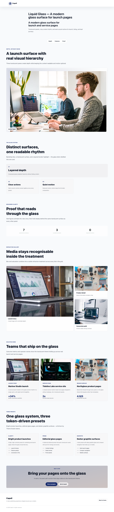
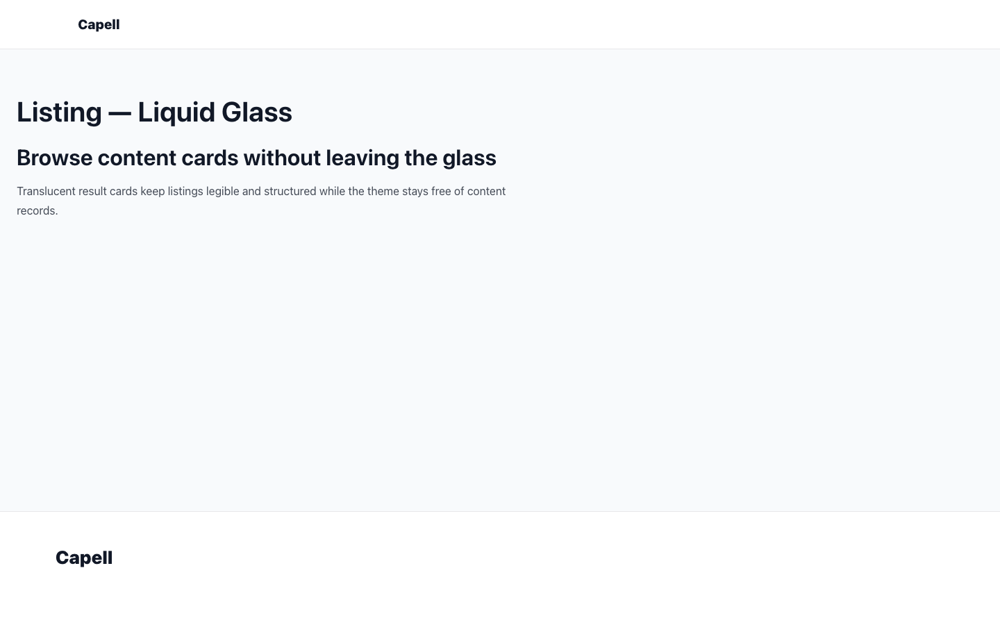

# Theme Liquid Glass

<!-- prettier-ignore-start -->

## What This Plugin Adds

Theme Liquid Glass is an **Available**, **No schema impact** Capell theme in the **Capell Themes** product group. It ships as `capell-app/theme-liquid-glass` and extends these surfaces: frontend.

Theme Liquid Glass adds translucent layers, depth, refraction grids, and floating navigation to Capell page presentation. Capell and Layout Builder retain ownership of the page data.

When selected, Layout Builder pages render with the theme's glass-layered visual system while preserving the existing content structure.

Evidence: [`src/LiquidGlassThemeServiceProvider.php`](src/LiquidGlassThemeServiceProvider.php), [`resources/views/widget/layered-depth-hero.blade.php`](resources/views/widget/layered-depth-hero.blade.php), [`resources/views/widget/refraction-grid.blade.php`](resources/views/widget/refraction-grid.blade.php), [`resources/views/widget/floating-glass-nav.blade.php`](resources/views/widget/floating-glass-nav.blade.php), [`capell.json`](capell.json), [`tests/Feature/LiquidGlassBespokeWidgetsTest.php`](tests/Feature/LiquidGlassBespokeWidgetsTest.php), [`tests/Feature/LiquidGlassVisualProofTest.php`](tests/Feature/LiquidGlassVisualProofTest.php).

Status details:

- Status: Available
- Tier: free
- Bundle: themes
- Composer package: `capell-app/theme-liquid-glass`
- Namespace: `Capell\ThemeLiquidGlass`
- Theme key: `liquid-glass`

## Why It Matters

**For developers:** Typed widget keys and a layout-native provider connect bespoke presentation to the shared Layout Builder container pipeline.

**For teams:** Design teams can apply a consistent glass treatment across hero, grid, and navigation sections without relocating content into theme-specific storage.

Evidence: [`src/LiquidGlassThemeServiceProvider.php`](src/LiquidGlassThemeServiceProvider.php), [`src/Enums/WidgetComponentEnum.php`](src/Enums/WidgetComponentEnum.php), [`tests/Unit/LiquidGlassThemeDefinitionTest.php`](tests/Unit/LiquidGlassThemeDefinitionTest.php), [`resources/views/widget/layered-depth-hero.blade.php`](resources/views/widget/layered-depth-hero.blade.php), [`resources/views/widget/refraction-grid.blade.php`](resources/views/widget/refraction-grid.blade.php), [`resources/views/widget/floating-glass-nav.blade.php`](resources/views/widget/floating-glass-nav.blade.php).

## Screens And Workflow

Screenshot contract: `docs/screenshots.json`.

Desktop, tablet, and mobile variants remain defined in the screenshot contract; this list groups them by workflow.

- Liquid Glass Homepage (frontend, required evidence).
- Liquid Glass Directory (frontend, required evidence).
- Liquid Glass Detail Article (frontend, required evidence).
- Liquid Glass Contact (frontend, required evidence).
- Liquid Glass Empty State (frontend, required evidence).
- Liquid Glass Page Not Found (frontend, supplementary evidence).
- Liquid Glass Call To Action (frontend, supplementary evidence).

## Technical Shape

### Service providers

- `Capell\ThemeLiquidGlass\LiquidGlassThemeServiceProvider`

### Actions

- `InstallLiquidGlassThemeDemoAction`

### Command signatures

- `capell:theme-liquid-glass-demo`

### Console command classes

- `DemoCommand`

### Manifest contributions

- `admin-page: Capell\ThemeLiquidGlass\Manifest\ThemeManagementPageContribution`

### Health checks

- `Capell\ThemeLiquidGlass\Health\ThemeLiquidGlassHealthCheck`

### Blade views

- `packages/theme-liquid-glass/resources/views/footer.blade.php`
- `packages/theme-liquid-glass/resources/views/header/index.blade.php`
- `packages/theme-liquid-glass/resources/views/sections/content-listing.blade.php`
- `packages/theme-liquid-glass/resources/views/sections/cta.blade.php`
- `packages/theme-liquid-glass/resources/views/sections/features.blade.php`
- `packages/theme-liquid-glass/resources/views/sections/footer.blade.php`
- `packages/theme-liquid-glass/resources/views/sections/hero.blade.php`
- `packages/theme-liquid-glass/resources/views/sections/navigation.blade.php`
- `packages/theme-liquid-glass/resources/views/sections/presets.blade.php`
- `packages/theme-liquid-glass/resources/views/sections/proof.blade.php`
- `packages/theme-liquid-glass/resources/views/sections/showcase.blade.php`
- `packages/theme-liquid-glass/resources/views/widget/cta.blade.php`
- `packages/theme-liquid-glass/resources/views/widget/floating-glass-nav.blade.php`
- `packages/theme-liquid-glass/resources/views/widget/glass-feature-card.blade.php`
- `packages/theme-liquid-glass/resources/views/widget/layered-depth-hero.blade.php`
- `packages/theme-liquid-glass/resources/views/widget/presets.blade.php`
- `packages/theme-liquid-glass/resources/views/widget/refraction-grid.blade.php`
- `packages/theme-liquid-glass/resources/views/widget/showcase.blade.php`
- `packages/theme-liquid-glass/resources/views/widget/translucent-stat-band.blade.php`

### Cache tags

- `theme-liquid-glass`

## Data Model

This theme has no schema impact. It relies on core Capell site, page, locale, and theme records instead of declaring package-owned tables.

## Install Impact

- Required packages: `capell-app/core`, `capell-app/theme-foundation`, `capell-app/frontend`, `capell-app/layout-builder`.
- Admin navigation: declares `admin-page: ThemeManagementPageContribution`; each Filament page or resource controls its own navigation visibility.
- Admin/editor extensions: none declared.
- Permissions: no package permission declarations or Shield gates detected; host access rules still apply.
- Public routes: none declared.
- Database changes: no package migrations declared.
- Config: no package config files.
- Settings: no package settings declared.
- Queues or schedules: none declared.
- Cache tags: `theme-liquid-glass`.
- Commands: `capell:theme-liquid-glass-demo`.

## Common Pitfalls

- Keep required Capell packages on compatible v4 releases: `capell-app/core`, `capell-app/theme-foundation`, `capell-app/frontend`, `capell-app/layout-builder`.
- Keep public Blade and cached HTML free of authoring markers, model IDs, permissions, signed editor URLs, and lazy database queries.
- Custom write integrations must preserve invalidation for `theme-liquid-glass` cache tags.

## Troubleshooting

| Symptom | Likely cause | Check | Fix |
| --- | --- | --- | --- |
| Package surface is missing after install | Provider or manifest is not loaded | Confirm `capell.json`, package `composer.json`, and provider registration | Reinstall the package, refresh Composer autoload, and clear host caches |
| Public output leaks unexpected state | Render data, cache variation, or authoring boundary has regressed | Check public Blade, cache tags, and public-output safety tests | Move data loading out of Blade and rerun the package public-output tests |

## Quick Start

1. Install the package: `composer require capell-app/theme-liquid-glass`.
2. See it working: run `php artisan capell:theme-liquid-glass-demo`.
3. Open `/theme-liquid-glass` and confirm the public output renders without admin state.

## Next Steps

- [Package docs](docs/README.md)
- [Overview](docs/overview.md)
- [Troubleshooting](#troubleshooting)
- [Screenshot contract](docs/screenshots.json)
- [Marketplace assets](docs/assets/marketplace/)
- [Capell content language plan](../../docs/CONTENT_LANGUAGE_PLAN.md)
- [Capell documentation design system](../../docs/DESIGN_SYSTEM.md)
- [Capell and package ERD notes](../../docs/erd/capell-and-package-erds.md)
- Related packages: [Theme Foundation](../theme-foundation/README.md), [Layout Builder](../layout-builder/README.md).
- Focused tests: `vendor/bin/pest packages/theme-liquid-glass/tests --configuration=phpunit.xml`.

<!-- prettier-ignore-end -->
