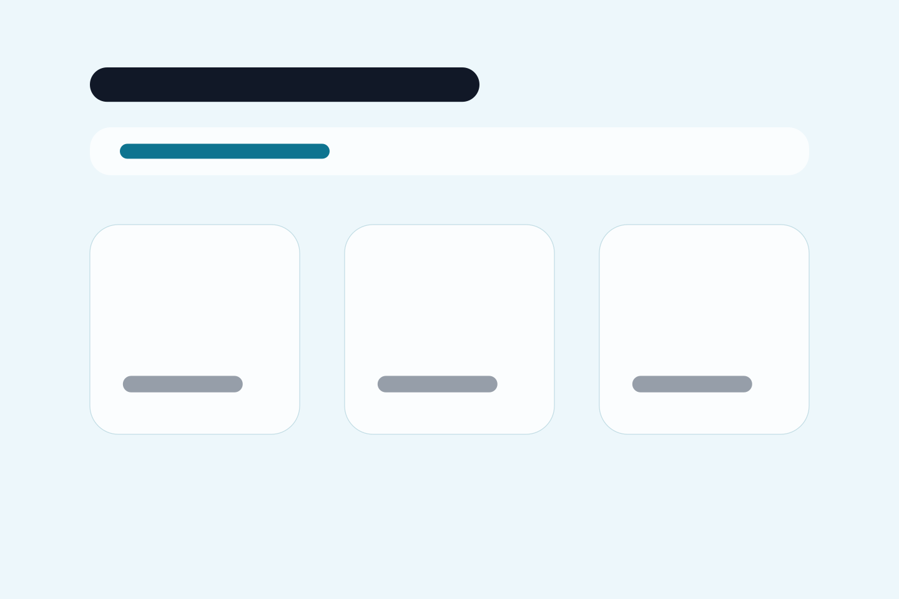
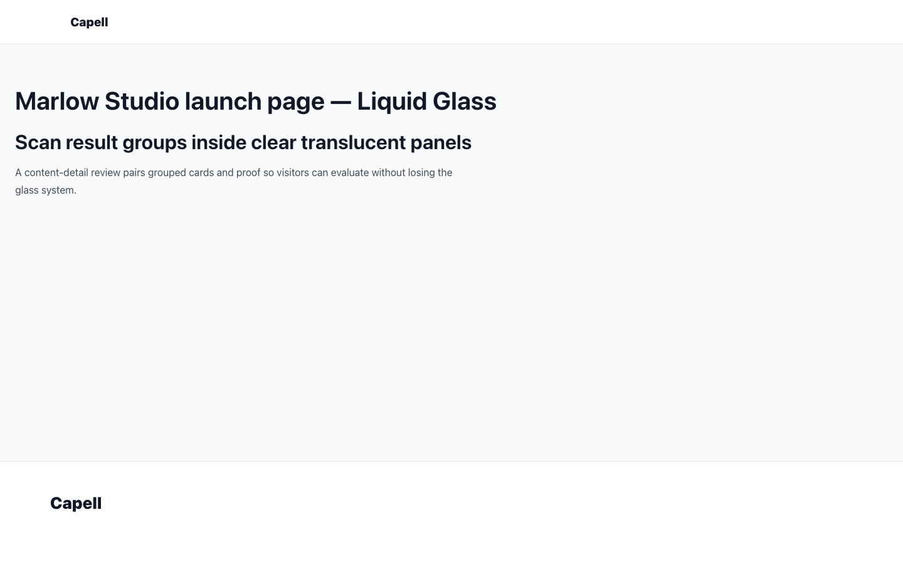
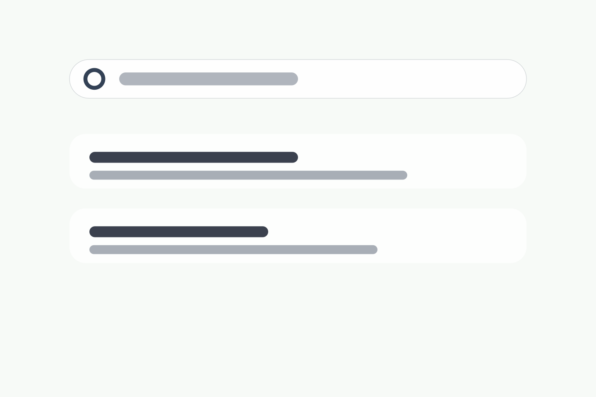
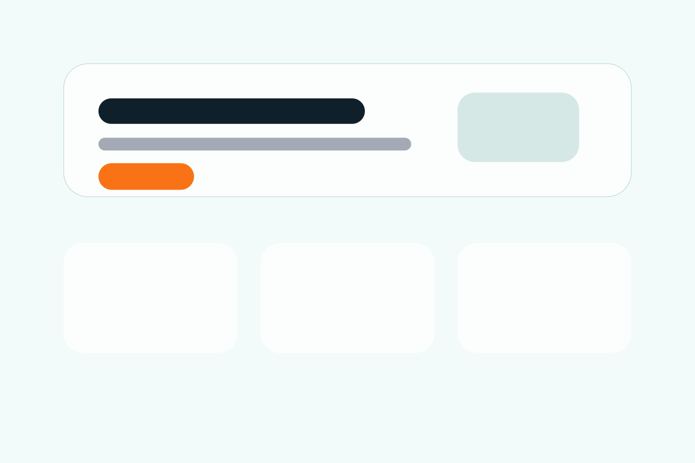
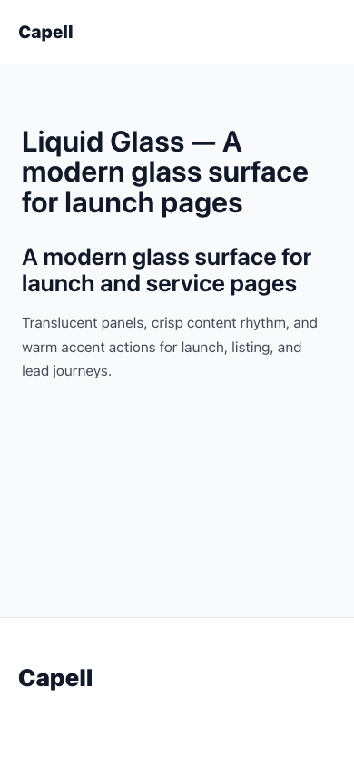

# Liquid Glass

<!-- prettier-ignore-start -->

Translucent panels floating over a soft mint-to-lilac wash, near-black grotesque headlines, and a warm accent for the one action that matters. Liquid Glass is a free theme for launch pages, service pages, and lead journeys — the surface is the design, the copy sits on top of it.


## Put it on your site

```bash
composer require capell-app/theme-liquid-glass
```

Then, in the admin:

1. Open **System → Themes**. Liquid Glass appears as an installed package definition.
2. Choose **Create theme** to turn that definition into a theme record you can edit.
3. Choose **Preview**, pick the site, page, and preset you want to look at, and open it in a new tab. The live site is untouched at this point.
4. Choose **Apply theme** when you are ready. Set **Activation scope** to **Global** to change the default theme for every site without its own override, or to **Selected sites** to change only the sites you name.

Applying a theme refreshes the frontend cache keys for the sites it affects, so the change shows immediately.

### The three presets

Liquid Glass ships three presets, and the **Preview** dialog lets you pick between them before anything goes live:

- **bright product launches** — the pale, high-contrast surface shown above.
- **editorial glass pages** — the tinted mint wash with panels layered over it.
- **darker graphite surfaces** — the same geometry on dark glass.

All three are Theme Studio tokens, not separate templates, so switching preset restyles the whole site without touching a Blade file.

### Start from the demo content

To get the pages below rather than an empty site:

```bash
php artisan capell:theme-liquid-glass-demo
```

The command takes `--url`, `--languages`, and `--sites`, so you can seed a single site or a whole multilingual set.

## The pages you get

### The lead page

The clearest look at the theme. A four-line headline in heavy grotesque, a mint-and-lilac gradient bleeding behind it, a filled dark-green **Get in touch** button paired with an outlined **View features**, and a raised white glass card holding the supporting copy. The contact route is presentational — no admin fields, package names, or editor URLs leak into the public page.


### The card grid

Entries sit in white rounded cards inside a larger glass container, each with a landscape photo, a small green **PREVIEW** eyebrow, a title, and one line of summary. A three-column grid falls back to a ragged final row rather than stretching cards to fill it. The footer below splits into Preview, Content, and Support columns.



### Listing header

The listing page leads with the same masthead-and-headline block as the homepage, so a browse page and a launch page share one rhythm. The subhead does the work of telling the visitor which of the two they are on.


### Detail

A single content record, given the same headline treatment as the homepage rather than a separate article chrome. Grouped cards and proof sit under it.



### Search

A pill-shaped search field with a ring-outline icon, then results as stacked white panels with a dark title bar and a lighter summary line. Everything is rounded to the same radius as the cards.



### Landing sections

Hero, then a three-up feature row. The hero panel is outlined rather than filled, and the single orange accent button is the only saturated colour on the page — which is exactly the point of it.



## On a phone

The masthead keeps just the site name, the headline wraps to three lines without dropping down the type scale, and the panels go full width with the same corner radius.



## Before you install

Liquid Glass extends the **Foundation** theme (`default`) rather than replacing it, and renders through the shared layout-builder container pipeline. It needs these packages present:

- `capell-app/core`
- `capell-app/theme-foundation`
- `capell-app/frontend`
- `capell-app/layout-builder`

Composer pulls them in for you. Liquid Glass declares no optional pairings and no conflicts.

Colours, fonts, and spacing are Theme Studio tokens, so you can change them under **Customize** without editing a Blade file. It is one of two free themes, alongside Foundation itself.

---

For the package boundary, runtime surfaces, and troubleshooting, see the [package README](../README.md).

<!-- prettier-ignore-end -->
